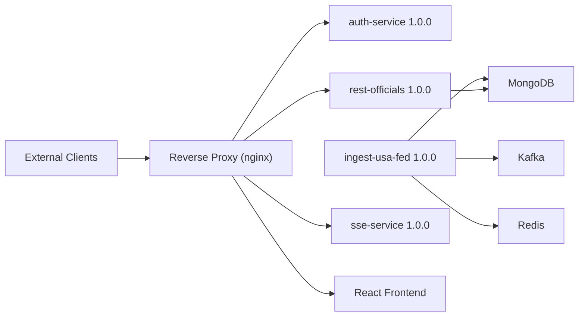

# Platform Architecture

> Generated by `./gradlew generateArchitectureDoc`. Do not edit manually.

This document visualizes the relationships between Beacon services, shared infrastructure, and public ingress.

## Service and Infrastructure Graph

Service nodes show semantic versions. Infrastructure nodes highlight shared dependencies and ingress routing, including MongoDB, Redis, Kafka, and the reverse proxy that fronts external traffic.
