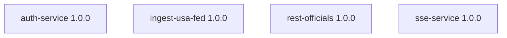

# Cloud Services

> Generated by `./gradlew generateServiceMesh`. Do not edit manually.

The `services/` directory contains every deployable backend workload that powers Beacon. Each subdirectory is a Spring Boot microservice with its own Dockerfile, infrastructure configuration, and Gradle module.

## Active Services

| Service | Version | Consumes Services |
| --- | --- | --- |
| `auth-service` | 1.0.0 | _None_ |
| `ingest-usa-fed` | 1.0.0 | _None_ |
| `rest-officials` | 1.0.0 | _None_ |
| `sse-service` | 1.0.0 | _None_ |

Run `./gradlew generateServiceMesh` after modifying inter-service dependencies to refresh this document.
